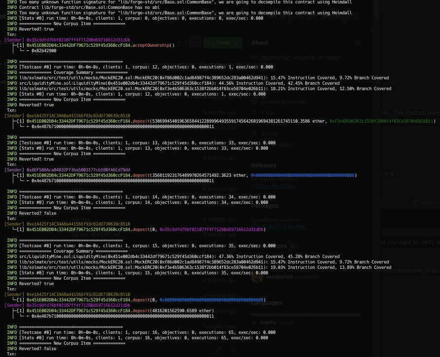

# Audit Report with Fuzzing and Formal Verification Test Suite

A time-boxed independent security assessment of the Glifio LiquidityMine's contract was done by Zealynx Security, with a focus on the security aspects of the application’s implementation.

We performed the security assessment based on the agreed scope, following our approach
and methodology. During the assessment the contract was reviewed and a report with found issues is shared below. Also, it was created a security test suite implementing Fuzzing and Invariant tests and Formal Verification.

# Table of Contents

# Overview

Below it is shared a list with 2 Medium and 2 Low issues raised and a few Informational suggestions to improve the code quality.Also, it can be found a list and short summary of all the security tests implemented with multiple tools. 

Besides that we provided a complete documentation about the test setup, how to run each of the tests and further resources to understand and use the tools used.


# Vulnerability Findings List

| Severity      | Title                                                   | Link                                                                                                   | Description                                                                                                                                                                                                                                                                                                                                                             |
|---------------|---------------------------------------------------------|--------------------------------------------------------------------------------------------------------|-------------------------------------------------------------------------------------------------------------------------------------------------------------------------------------------------------------------------------------------------------------------------------------------------------------------------------------------------------------------------|
| Medium        | Imprecision in Rewards Distribution Leading to Residual Dust |                                                                                                        | The `LiquidityMine` contract exhibits imprecision in its rewards distribution mechanism, leading to residual dust left in the contract due to discrepancies between the methods used for calculating accrued rewards and claimed rewards.                                                                                                                              |
| Medium        | Precision and Rounding Error Vulnerability in Reward Calculations |                                                                                                        | Precision and rounding errors in reward calculations cause inconsistencies between `accRewardsTotal` and the sum of claimed and unclaimed rewards. Use higher precision data types or fixed-point arithmetic to ensure consistent calculations.                                                                                                                        |
| Low           | Lack of Zero Address Check                              |                                                                                                        | Lack of zero address validation in `LiquidityMine.sol` functions: `deposit`, `_withdraw`, `_harvest`, and the constructor. Add zero address validation.                                                                                                                                                                                                                |
| Low           | Use safeTransfer and safeTransferFrom                   |                                                                                                        | Tokens not compliant with the ERC20 specification could return `false` from the `transfer` and `transferFrom` functions. Use `SafeERC20` library from OpenZeppelin and call `safeTransfer` or `safeTransferFrom` when transferring ERC20 tokens.                                                                                                                          |
| Informational | Consider adding relevant name to variable               | [Link](https://github.com/glifio/token/blob/c62b2b5034c6e8de4e3dd75fc3f97f7d1d398e4e/src/LiquidityMine.sol#L97) | Since `u` is not descriptive, consider giving a descriptive name such as `userInfo`.                                                                                                                                                                                                                                          |
| Informational | Emit events in Ownable contract                         | [Link](https://github.com/wadealexc/fevmate/blob/main/contracts/access/OwnedClaimable.sol)              | Missing events: `OwnershipTransferred` and `OwnershipPending`.                                                                                                                                                                                                                                                                  |
| Informational | Missing Checks for non-zero transfer value calls        |                                                                                                        | Checking for non-zero values can prevent an external call to save gas. Functions `deposit` and `_withdraw` lack input validation for `uint256 amount`. Add zero amount validation.                                                                                                                                                                                       |
| Informational | Return values of _computeAccRewards never used          |                                                                                                        | Out of the three parameters from the return of the function `_computeAccRewards`, only `lockTokenSupply` is actually assigned/used. Use named returned parameters or assign the variables to the result to return or remove the named return parameters.                                                                                                              |


## [M-1] Precision and Rounding Error Vulnerability in Reward Calculations

### Summary

During the audit of the `LiquidityMine` contract, a significant discrepancy was discovered between the total rewards accrued (`accRewardsTotal`) and the sum of claimed (`rewardTokensClaimed`) and unclaimed rewards. This discrepancy, found during fuzz testing with both high and low values, stems from precision and rounding errors within the contract's reward calculation mechanisms. The magnitude of the discrepancy increases with larger values, indicating a vulnerability in handling large numbers accurately.

### Vulnerability Description

The `LiquidityMine` contract is designed to distribute rewards to users who lock tokens. However, precision and rounding errors in reward calculations cause inconsistencies between `accRewardsTotal` and the sum of `rewardTokensClaimed` and unclaimed rewards. These errors occur primarily in the following functions:

- `updateAccounting`
- `pendingRewards`
- `withdraw`
- `harvest`

The key issue arises from the way rewards per token are calculated and updated, specifically in how fixed-point arithmetic is handled in these functions. When large values are involved, the precision loss becomes significant, leading to discrepancies.

### Impact

The discrepancy results in incorrect reward distributions, causing users to receive less or more than their entitled rewards. This inaccuracy undermines the reward system's integrity and can lead to financial discrepancies and potential disputes among users. The impact is particularly severe with higher values, but even small values exhibit minor discrepancies that undermine the system's reliability.

### Proof of Concept (Test)

The following test case demonstrates the discrepancy using fuzz testing with both low and extremely high values, highlighting the difference between the total rewards accrued and the sum of claimed and unclaimed rewards.

```solidity
function testFuzz_InvariantDepositWithdraw(uint256 depositAmount, uint256 withdrawAmount, address beneficiary) public {
    // Limit the fuzzing range for extremely high values
    depositAmount = bound(depositAmount, 1e35, 1e40); // Limit deposit amount between 1e35 and 1e40
    withdrawAmount = bound(withdrawAmount, 1e35, depositAmount); // Limit withdraw amount between 1e35 and depositAmount
    vm.assume(beneficiary != address(0) && beneficiary != address(lm)); // Assume beneficiary is not the zero address or the contract address

    // Mint tokens to the beneficiary so they can be deposited
    MintBurnERC20(address(lockToken)).mint(beneficiary, depositAmount);
    vm.prank(beneficiary);
    lockToken.approve(address(lm), depositAmount);

    // Perform the deposit
    vm.prank(beneficiary);
    lm.deposit(depositAmount, beneficiary);

    // Add user to the list of users if not already tracked
    if (!isUserTracked(beneficiary)) {
        users.push(beneficiary);
    }

    // Load rewards into the contract
    uint256 totalRewards = 1e40; // Using an extremely high value for rewards
    _loadRewards(totalRewards);

    // Simulate passage of time to accumulate rewards
    uint256 blocksPassed = 1000;
    vm.roll(block.number + blocksPassed);

    // Update accounting to reflect the passage of time and accumulated rewards
    lm.updateAccounting();

    // Ensure there are rewards to harvest
    uint256 pendingRewardsBeforeWithdraw = lm.pendingRewards(beneficiary);
    console.log("Pending rewards before withdrawal:", pendingRewardsBeforeWithdraw);

    // Verify user state before withdraw
    LiquidityMine.UserInfo memory userBeforeWithdraw = lm.userInfo(beneficiary);

    // Perform the withdraw
    vm.prank(beneficiary);
    lm.withdraw(withdrawAmount, beneficiary);

    // Ensure the rewards are still correct after withdrawal
    uint256 pendingRewardsAfterWithdraw = lm.pendingRewards(beneficiary);
    console.log("Pending rewards after withdrawal:", pendingRewardsAfterWithdraw);

    // Verify user state after withdraw
    LiquidityMine.UserInfo memory userAfterWithdraw = lm.userInfo(beneficiary);

    // Perform the harvest
    vm.prank(beneficiary);
    lm.harvest(pendingRewardsAfterWithdraw, beneficiary);

    // Verify user state after harvest
    LiquidityMine.UserInfo memory userAfterHarvest = lm.userInfo(beneficiary);

    // Verify pending rewards after harvest
    uint256 pendingRewardsAfterHarvest = lm.pendingRewards(beneficiary);
    console.log("Pending rewards after harvest:", pendingRewardsAfterHarvest);

    // Check that the total claimed rewards are correct
    uint256 totalClaimedRewardsFromContract = lm.rewardTokensClaimed();
    uint256 totalClaimedRewardsCalculated = depositAmount.mulWadDown(lm.accRewardsPerLockToken());

    // Final assertions
    assertEq(pendingRewardsAfterHarvest, 0, "Pending rewards after harvest should be zero");
    assertEq(totalClaimedRewardsFromContract, totalClaimedRewardsCalculated, "Total claimed rewards should be correct");

    // Additional final state verification
    LiquidityMine.UserInfo memory beneficiaryInfo = lm.userInfo(beneficiary);

    // Verify accRewardsTotal and rewardTokensClaimed
    uint256 accRewardsTotal = lm.accRewardsTotal();
    console.log("accRewardsTotal:", accRewardsTotal);
    console.log("rewardTokensClaimed:", totalClaimedRewardsFromContract);
    uint256 totalUnclaimedRewards = 0;
    for (uint256 i = 0; i < users.length; i++) {
        totalUnclaimedRewards += lm.userInfo(users[i]).unclaimedRewards;
    }
    uint256 sumClaimedAndUnclaimed = totalClaimedRewardsFromContract + totalUnclaimedRewards;
    uint256 discrepancy = accRewardsTotal > sumClaimedAndUnclaimed ? accRewardsTotal - sumClaimedAndUnclaimed : sumClaimedAndUnclaimed - accRewardsTotal;
    console.log("Discrepancy:", discrepancy);
    assertEq(
        accRewardsTotal,
        sumClaimedAndUnclaimed,
        "Total rewards accrued should equal the sum of claimed and unclaimed rewards"
    );
}

```

### Mitigation
To be discussed


## [M-2] Imprecision in Rewards Distribution Leading to Residual Dust

### Vulnerability Report: Imprecision in Rewards Distribution Leading to Residual Dust

### Summary

The `LiquidityMine` contract exhibits imprecision in its rewards distribution mechanism, leading to residual dust left in the contract. This occurs because of discrepancies between the methods used for calculating accrued rewards and claimed rewards, especially when the new rewards are less than the total locked tokens.

### Vulnerability Description

The `LiquidityMine` contract calculates accrued rewards based on the number of blocks passed and the reward per epoch. However, claimed rewards are calculated individually for each user based on their interactions with the contract. This difference in calculation methods can lead to slight inaccuracies, particularly when the rewards per epoch divided by the total locked tokens results in a non-integer value, causing rounding issues. When `updateAccounting` is called with new rewards less than the total locked tokens, these rounding issues can result in residual dust remaining in the contract, which users cannot claim.

### Impact

1. **Residual Dust**: Users may miss out on their full reward entitlement, leading to small amounts of unclaimed rewards remaining in the contract.
2. **User Trust**: The presence of unclaimed rewards can undermine user trust, as they may perceive the reward distribution system to be unfair or inefficient.

### Proof of Concept (Test)

To demonstrate this vulnerability, a series of fuzz tests were conducted. The tests involved multiple participants depositing, withdrawing, and harvesting rewards. The results showed discrepancies between the total reward cap and the sum of accrued rewards and remaining balance, indicating residual dust.

```solidity
function testFuzz_ImprecisionInRewardsDistribution(uint256 depositAmount, uint256 withdrawAmount, uint256 rewardAmount, address beneficiary) public {
    uint256 numberOfParticipants = 500;
    address[] memory participants = new address[](numberOfParticipants);
    uint256 blocksPassed = 1000;

    // Limit the fuzzing range for more reasonable values
    depositAmount = bound(depositAmount, 1 * 1e18, 100 * 1e18);
    withdrawAmount = bound(withdrawAmount, 1 * 1e18, depositAmount);
    rewardAmount = bound(rewardAmount, 1 * 1e18, 1000 * 1e18);

    // Generate and set up participants
    for (uint256 i = 0; i < numberOfParticipants; i++) {
        participants[i] = vm.addr(i + 1);
        vm.assume(participants[i] != address(0) && participants[i] != address(lm));

        // Mint lock tokens to the participants
        MintBurnERC20(address(lockToken)).mint(participants[i], depositAmount * 2); // Enough for deposit and potential multiple actions
        vm.prank(participants[i]);
        lockToken.approve(address(lm), depositAmount * 2);
    }

    // Mint reward tokens to the first participant to load rewards into the contract
    MintBurnERC20(address(rewardToken)).mint(participants[0], rewardAmount);
    vm.prank(participants[0]);
    rewardToken.approve(address(lm), rewardAmount);

    // Participants perform deposits
    for (uint256 i = 0; i < numberOfParticipants; i++) {
        vm.prank(participants[i]);
        lm.deposit(depositAmount, participants[i]);
    }

    // Load rewards into the contract by the first participant
    vm.prank(participants[0]);
    lm.loadRewards(rewardAmount);

    // Simulate passage of time to accumulate rewards
    vm.roll(block.number + blocksPassed);

    // Update accounting to reflect the passage of time and accumulated rewards
    lm.updateAccounting();

    // Participants perform withdrawals
    for (uint256 i = 0; i < numberOfParticipants; i++) {
        vm.prank(participants[i]);
        lm.withdraw(withdrawAmount, participants[i]);
    }

    // Participants harvest their rewards
    for (uint256 i = 0; i < numberOfParticipants; i++) {
        uint256 pendingRewards = lm.pendingRewards(participants[i]);
        if (pendingRewards > 0) {
            vm.prank(participants[i]);
            lm.harvest(pendingRewards, participants[i]);
        }
    }

    // Validate invariants
    uint256 accRewardsTotal = lm.accRewardsTotal();
    uint256 totalRewardCap = lm.totalRewardCap();
    uint256 rewardTokensClaimed = lm.rewardTokensClaimed();
    uint256 remainingBalance = rewardToken.balanceOf(address(lm));

    console.log("accRewardsTotal:", accRewardsTotal);
    console.log("rewardTokensClaimed:", rewardTokensClaimed);
    console.log("remainingBalance:", remainingBalance);
    console.log("totalRewardCap:", totalRewardCap);

    uint256 calculatedSum = accRewardsTotal + remainingBalance;
    assertEq(totalRewardCap, calculatedSum, "totalRewardCap should equal the sum of accRewardsTotal and remaining balance, indicating no dust");
}

```

### Mitigation

To mitigate this issue, consider the following steps:

1. **Precise Calculation**: Implement a more precise calculation method that minimizes rounding errors. For example, using a fixed-point arithmetic library.
2. **Residual Dust Handling**: Introduce a mechanism to periodically sweep residual dust and redistribute it among users or send it to a predefined address. This ensures that users receive their full entitled rewards without any residual amounts left in the contract.


## [L-1] Lack of Zero Address Check

### Description:

Lack of zero address validation has been found in many instances in

the contract `LiquidityMine.sol`. Functions `deposit`, `_withdraw`, `_harvest`, and the constructor are missing this check.

### Mitigation:

Add zero address validation


## [L-2] Use safeTransfer and safeTransferFrom

### Description:

Tokens not compliant with the ERC20 specification could return `false` from the `transfer` and `transferFrom` functions call to indicate the transfer fails.

Since the IERC20 token addresses are passed in the constructor, it is convenient to protect from any unexpected implementation.

### Impact

While the calling contract would not notice the failure if the return value is not checked. Checking the return value is a requirement, as written in the [EIP-20](https://eips.ethereum.org/EIPS/eip-20) specification:

> Callers MUST handle false from returns (bool success). Callers MUST NOT assume that false is never returned!
> 

### **Recommended Mitigation Steps**

Use the `SafeERC20` library [implementation](https://github.com/OpenZeppelin/openzeppelin-contracts/blob/master/contracts/token/ERC20/utils/SafeERC20.sol) from OpenZeppelin and call `safeTransfer` or `safeTransferFrom` when transferring ERC20 tokens.


## [I-1] Consider adding relevant name to variable

[https://github.com/glifio/token/blob/c62b2b5034c6e8de4e3dd75fc3f97f7d1d398e4e/src/LiquidityMine.sol#L97](https://github.com/glifio/token/blob/c62b2b5034c6e8de4e3dd75fc3f97f7d1d398e4e/src/LiquidityMine.sol#L97)

### Description:

Since `u` is not descriptive, consider giving a descriptive name such as `userInfo` 

```solidity
UserInfo storage u = _userInfo[user.normalize()];
```

## [I-2] Emit events in Ownable contract

[https://github.com/wadealexc/fevmate/blob/main/contracts/access/OwnedClaimable.sol](https://github.com/wadealexc/fevmate/blob/main/contracts/access/OwnedClaimable.sol)

### Missing:

```solidity
event OwnershipTransferred(address indexed oldOwner, address indexed newOwner);
event OwnershipPending(address indexed currentOwner, address indexed pendingOwner);
```


## [I-3] Missing Checks for non-zero transfer value calls

Severity: Informational

### Description:

Checking for non-zero values can prevent an external call to save gas. And in `deposit` and `_withdraw` there is no input validation for `uint256 amount` 

### Mitigation:

Add:

```solidity
if (amount == 0) revert ZeroAmountNotAllowed();
```


## [I-4] Return values of _computeAccRewards never used

### Description

Out of the three parameters from the return of the function `_computeAccRewards()` only `lockTokenSupply` is actually assigned/used.

```
returns (uint256 newAccRewardsPerLockToken, uint256 newAccRewardsTotal, uint256 lockTokenSupply)
```

It is recommended to either use named returned parameters without the `return` keyword, assigning the variable to the result to return or remove the named return parameters and use the `return` keyword.


# Security Test List

Aqui añade la tabla 


# Complete Documentation of Test Suite Implemented


| Section | Description |
|---------|-------------|
| [Installation](#installation) | Setup and installation requirements. |
| [Init](#init) | Initial setup and build commands. |
| [Where to Find the Tests](#where-to-find-the-tests) | Locations of different test suites. |
| [Testing Environments](#testing-environments) | Overview of testing environments: Foundry, Echidna, Halmos, Ityfuzz, Medusa, and Kontrol. |
| [Foundry Tests](#foundry) | How to run Foundry tests and where to find them. |
| [Echidna Tests](#echidna) | Setup and execution of Echidna tests. |
| [Halmos Tests](#halmos) | Information on setting up and running Halmos tests. |
| [Ityfuzz Tests](#ityfuzz) | Details on Ityfuzz testing environment and usage. |
| [Medusa Tests](#medusa) | Instructions for setting up and running Medusa tests. |
| [Kontrol Tests](#kontrol) | Guide to using Kontrol for test execution and debugging. |


## Installation

To be able to use this repository, you need to have the following installed:

- [Foundry]( https://book.getfoundry.sh/getting-started/installation)
- [Echidna]( https://github.com/crytic/echidna?tab=readme-ov-file#installation)
- [Medusa](https://github.com/crytic/medusa)
- [Halmos](https://github.com/a16z/halmos/tree/main)
- [Kontrol](https://github.com/runtimeverification/kontrol/tree/master)
- [Ityfuzz](https://github.com/fuzzland/ityfuzz)


## Init:

```js
 git submodule update --init --recursive
```
```js
sudo forge build -force
```
### You can find more information on this repository:
- [Example implementation 1](https://github.com/ZealynxSecurity/Zealynx/blob/main/OurWork/Fuzzing-and-Formal-Verification/public-contests/Olas%20Protocol/Readme-Olas.md)
- [Example implementation 2](https://github.com/ZealynxSecurity/BastionWallet)
- [Example implementation 3](https://github.com/ZealynxSecurity/Portals-local/tree/main)

## Where to find the tests

You can find the tests in various folders:

`The "onchain" folder is used to compile Halmos tests as they are configured through mocks since native FV testing is not available for onchain contracts`

- Foundry in the `test/Fuzz` folder
- Echidna in the `src/Echidna` folder
- Medusa in the `src/Echidna` folder
- Halmos in the `test/FormalVerification` folder
- Kontrol in the `test/FormalVerification` folder
- Ityfuzz in the `test/Fuzz` folder


# Testing Environments


## Foundry

### Resources to set up environment and understand approach

- [Documentation](https://book.getfoundry.sh/)
- [Create Invariant Tests for DeFi AMM Smart Contract](https://youtu.be/dWyJq8KGATg?si=JGYpABuOqR-1T6m3)

### Where are tests

- Foundry in the `test/Fuzz` folder

### How to run them

#### LiquidityMine.sol

- test/Fuzz/FuzzLiquidityMine.t.sol
  
```solidity
forge test --mc FuzzLiquidityMine
forge test --mc FuzzLiquidityMine --mt <test>
```


## Echidna

### Resources to set up environment and understand approach

- [Documentation](https://secure-contracts.com/index.html)
- [Properties](https://github.com/crytic/properties)
- [echidna](https://github.com/crytic/echidna)
- [Echidna Tutorial: #2 Fuzzing with Assertion Testing Mode](https://www.youtube.com/watch?v=em8xXB9RHi4&ab_channel=bloqarl)
- [Echidna Tutorial: #1 Introduction to create Invariant tests with Solidity](https://www.youtube.com/watch?v=yUC3qzZlCkY&ab_channel=bloqarl)
- [Echidna Tutorial: Use Echidna Cheatcodes while Fuzzing](https://www.youtube.com/watch?v=SSzh5GlqteI&ab_channel=bloqarl)


### Where are tests

- Echidna in the `src/Echidna` folder

### How to run them

#### LiquidityMine.sol

- src/Echidna/EchidnaLiquidityMine.sol

```solidity
 echidna . --contract EchidnaLiquidityMine --config config.yaml
```

## Medusa

### Resources to set up environment and understand approach

- [Documentation](https://github.com/crytic/medusa)
- [Properties](https://github.com/crytic/properties)
- [echidna](https://github.com/crytic/echidna)
- [Fuzzing Smart Contracts with MEDUSA](https://youtu.be/I4MP-KXJE54?si=LolEZWBvjbgqr0be)

### Where are tests

- Medusa in the `src/Echidna` folder

### How to run them

#### LiquidityMine.sol

- src/Echidna/EchidnaLiquidityMine.sol


```solidity
medusa fuzz
```

## Halmos

### Resources to set up environment and understand approach

- [CheatCode](https://github.com/a16z/halmos-cheatcodes)
- [Documentation](https://github.com/a16z/halmos-cheatcodes)
- [Formal Verification In Practice: Halmos, Hevm, Certora, and Ityfuzz](https://allthingsfuzzy.substack.com/p/formal-verification-in-practice-halmos?r=1860oo&utm_campaign=post&utm_medium=web)
- [Examples](https://github.com/a16z/halmos/tree/main/examples)

### Where are tests

- Halmos in the test/FormalVerification folder

### How to run them

#### LiquidityMine.sol

- test/FormalVerification/HalmosFV.t.sol
  
```solidity
halmos --contract HalmosFVLiquidityMine --solver-timeout-assertion 0 
halmos --contract HalmosFVLiquidityMine --function <test> --solver-timeout-assertion 0
```


## Ityfuzz

### Resources to set up environment and understand approach

- [GitHub](https://github.com/fuzzland/ityfuzz/tree/master)
- [Documentation](https://docs.ityfuzz.rs/)
- [Formal Verification In Practice: Halmos, Hevm, Certora, and Ityfuzz](https://allthingsfuzzy.substack.com/p/formal-verification-in-practice-halmos?r=1860oo&utm_campaign=post&utm_medium=web)
- [Examples](https://github.com/a16z/halmos/tree/main/examples)
- [Video examples](https://mirror.xyz/0x44bdEeB120E0fCfC40fad73883C8f4D60Dfd5A73/IQgirpcecGOqfWRozQ0vd8e5mLLjWfX5Pif2Fbynu6c)

### Where are tests

- Ityfuzz in the `test/Fuzz` folder

### How to run them

We can run ityfuzz in two main ways:

1. Running ityfuzz on Invariant Tests
Use ityfuzz to run on top of the invariant tests you have already written. This method leverages the existing invariant checks in your tests.

2. [Using Inline Assertions with ityfuzz](https://github.com/fuzzland/ityfuzz/blob/master/solidity_utils/lib.sol)

To use [inline assertions with ityfuzz](https://github.com/fuzzland/ityfuzz/blob/960e9e148d376615df776529ddaedba93af0dced/tests/evm/complex-condition/test.sol), follow these steps:

Step 1: Incorporate the solidity_utils library into your contract (LiquidityMine.sol):

```solidity
import "lib/solidity_utils/lib.sol";
```

Step 2: Add the cheat code bug() at the points in your code where you want to verify an invariant.


#### LiquidityMine.sol

- test/Fuzz/ItyfuzzInvariant.t.sol
  
```solidity
ityfuzz evm -m ItyfuzzInvariant -- forge build
ityfuzz evm -m test/Fuzz/ItyfuzzInvariant.t.sol:ItyfuzzInvariant -- forge test --mc ItyfuzzInvariant --mt <test>

```





## Kontrol

### Resources to set up environment and understand approach

- [CheatCode](https://github.com/runtimeverification/kontrol-cheatcodes/tree/master)
- [Documentation](https://docs.runtimeverification.com/kontrol)
- [Formal Verification In Practice: Halmos, Hevm, Certora, and Ityfuzz](https://allthingsfuzzy.substack.com/p/formal-verification-in-practice-halmos?r=1860oo&utm_campaign=post&utm_medium=web)
- [Examples](https://github.com/runtimeverification/kontrol-demo)

### Where are tests

- Kontrol in the test/FormalVerification folder

### How to run them

#### LiquidityMine.sol

- test/FormalVerification/KontrolFV.t.sol
  

To use **Kontrol** effectively, follow these steps:


Step 1: Recompile Your Project

In most cases, you need to recompile your project:
```bash
forge build --force
```

Step 2: Compile Kontrol

Next, compile Kontrol:
```bash
kontrol build
```

Step 3: Execute Tests

You can execute your tests in several ways. Here is a clear method using the command:
```bash
kontrol prove --match-test KontrolFVLiquidityKontrol.<test> --max-depth 10000 --no-break-on-calls --max-frontier-parallel 2 --verbose
```

Step 4: [Investigate Test Failures](https://docs.runtimeverification.com/kontrol/guides/kontrol-example/k-control-flow-graph-kcfg)

If you want to delve deeper into a test to understand why it failed, you can use the following commands for a detailed breakdown of the interaction:

```bash
kontrol view-kcfg 'KontrolFVLiquidityKontrol.testFuzz_Deposit(uint256,address)' --version <specify version>
```
or
```bash
kontrol view-kcfg KontrolFVLiquidityKontrol.testFuzz_Deposit
```
or
```bash
kontrol show KontrolFVLiquidityKontrol.testFuzz_Deposit
```


