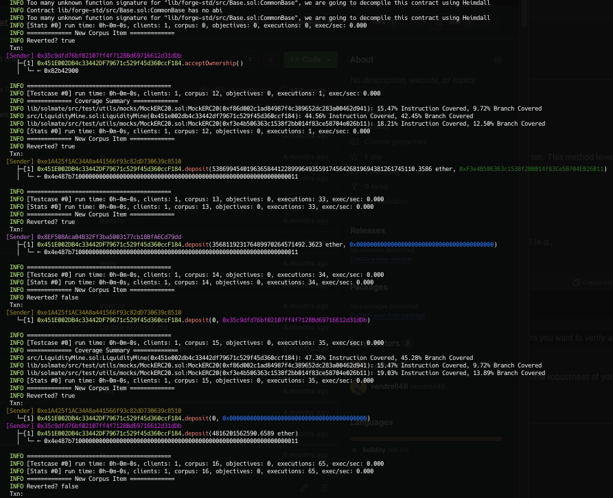

| Section | Description |
|---------|-------------|
| [Installation](#installation) | Setup and installation requirements. |
| [Init](#init) | Initial setup and build commands. |
| [Where to Find the Tests](#where-to-find-the-tests) | Locations of different test suites. |
| [Testing Environments](#testing-environments) | Overview of testing environments: Foundry, Echidna, Halmos, Ityfuzz, Medusa, and Kontrol. |
| [Foundry Tests](#foundry) | How to run Foundry tests and where to find them. |
| [Echidna Tests](#echidna) | Setup and execution of Echidna tests. |
| [Halmos Tests](#halmos) | Information on setting up and running Halmos tests. |
| [Ityfuzz Tests](#ityfuzz) | Details on Ityfuzz testing environment and usage. |
| [Medusa Tests](#medusa) | Instructions for setting up and running Medusa tests. |
| [Kontrol Tests](#kontrol) | Guide to using Kontrol for test execution and debugging. |


## Installation

To be able to use this repository, you need to have the following installed:

- [Foundry]( https://book.getfoundry.sh/getting-started/installation)
- [Echidna]( https://github.com/crytic/echidna?tab=readme-ov-file#installation)
- [Medusa](https://github.com/crytic/medusa)
- [Halmos](https://github.com/a16z/halmos/tree/main)
- [Kontrol](https://github.com/runtimeverification/kontrol/tree/master)
- [Ityfuzz](https://github.com/fuzzland/ityfuzz)


## Init:

```js
 git submodule update --init --recursive
```
```js
sudo forge build -force
```
### You can find more information on this repository:
- [Example implementation 1](https://github.com/ZealynxSecurity/Zealynx/blob/main/OurWork/Fuzzing-and-Formal-Verification/public-contests/Olas%20Protocol/Readme-Olas.md)
- [Example implementation 2](https://github.com/ZealynxSecurity/BastionWallet)
- [Example implementation 3](https://github.com/ZealynxSecurity/Portals-local/tree/main)

## Where to find the tests

You can find the tests in various folders:

`The "onchain" folder is used to compile Halmos tests as they are configured through mocks since native FV testing is not available for onchain contracts`

- Foundry in the `test/Fuzz` folder
- Echidna in the `src/Echidna` folder
- Medusa in the `src/Echidna` folder
- Halmos in the `test/FormalVerification` folder
- Kontrol in the `test/FormalVerification` folder
- Ityfuzz in the `test/Fuzz` folder


# Testing Environments


## Foundry

### Resources to set up environment and understand approach

- [Documentation](https://book.getfoundry.sh/)
- [Create Invariant Tests for DeFi AMM Smart Contract](https://youtu.be/dWyJq8KGATg?si=JGYpABuOqR-1T6m3)

### Where are tests

- Foundry in the `test/Fuzz` folder

### How to run them

#### LiquidityMine.sol

- test/Fuzz/FuzzLiquidityMine.t.sol
  
```solidity
forge test --mc FuzzLiquidityMine
forge test --mc FuzzLiquidityMine --mt <test>
```


## Echidna

### Resources to set up environment and understand approach

- [Documentation](https://secure-contracts.com/index.html)
- [Properties](https://github.com/crytic/properties)
- [echidna](https://github.com/crytic/echidna)
- [Echidna Tutorial: #2 Fuzzing with Assertion Testing Mode](https://www.youtube.com/watch?v=em8xXB9RHi4&ab_channel=bloqarl)
- [Echidna Tutorial: #1 Introduction to create Invariant tests with Solidity](https://www.youtube.com/watch?v=yUC3qzZlCkY&ab_channel=bloqarl)
- [Echidna Tutorial: Use Echidna Cheatcodes while Fuzzing](https://www.youtube.com/watch?v=SSzh5GlqteI&ab_channel=bloqarl)


### Where are tests

- Echidna in the `src/Echidna` folder

### How to run them

#### LiquidityMine.sol

- src/Echidna/EchidnaLiquidityMine.sol

```solidity
 echidna . --contract EchidnaLiquidityMine --config config.yaml
```

## Medusa

### Resources to set up environment and understand approach

- [Documentation](https://github.com/crytic/medusa)
- [Properties](https://github.com/crytic/properties)
- [echidna](https://github.com/crytic/echidna)
- [Fuzzing Smart Contracts with MEDUSA](https://youtu.be/I4MP-KXJE54?si=LolEZWBvjbgqr0be)

### Where are tests

- Medusa in the `src/Echidna` folder

### How to run them

#### LiquidityMine.sol

- src/Echidna/EchidnaLiquidityMine.sol


```solidity
medusa fuzz
```

## Halmos

### Resources to set up environment and understand approach

- [CheatCode](https://github.com/a16z/halmos-cheatcodes)
- [Documentation](https://github.com/a16z/halmos-cheatcodes)
- [Formal Verification In Practice: Halmos, Hevm, Certora, and Ityfuzz](https://allthingsfuzzy.substack.com/p/formal-verification-in-practice-halmos?r=1860oo&utm_campaign=post&utm_medium=web)
- [Examples](https://github.com/a16z/halmos/tree/main/examples)

### Where are tests

- Halmos in the test/FormalVerification folder

### How to run them

#### LiquidityMine.sol

- test/FormalVerification/HalmosFV.t.sol
  
```solidity
halmos --contract HalmosFVLiquidityMine --solver-timeout-assertion 0 
halmos --contract HalmosFVLiquidityMine --function <test> --solver-timeout-assertion 0
```


## Ityfuzz

### Resources to set up environment and understand approach

- [GitHub](https://github.com/fuzzland/ityfuzz/tree/master)
- [Documentation](https://docs.ityfuzz.rs/)
- [Formal Verification In Practice: Halmos, Hevm, Certora, and Ityfuzz](https://allthingsfuzzy.substack.com/p/formal-verification-in-practice-halmos?r=1860oo&utm_campaign=post&utm_medium=web)
- [Examples](https://github.com/a16z/halmos/tree/main/examples)
- [Video examples](https://mirror.xyz/0x44bdEeB120E0fCfC40fad73883C8f4D60Dfd5A73/IQgirpcecGOqfWRozQ0vd8e5mLLjWfX5Pif2Fbynu6c)

### Where are tests

- Ityfuzz in the `test/Fuzz` folder

### How to run them

We can run ityfuzz in two main ways:

1. Running ityfuzz on Invariant Tests
Use ityfuzz to run on top of the invariant tests you have already written. This method leverages the existing invariant checks in your tests.

2. [Using Inline Assertions with ityfuzz](https://github.com/fuzzland/ityfuzz/blob/master/solidity_utils/lib.sol)

To use [inline assertions with ityfuzz](https://github.com/fuzzland/ityfuzz/blob/960e9e148d376615df776529ddaedba93af0dced/tests/evm/complex-condition/test.sol), follow these steps:

Step 1: Incorporate the solidity_utils library into your contract (LiquidityMine.sol):

```solidity
import "lib/solidity_utils/lib.sol";
```

Step 2: Add the cheat code bug() at the points in your code where you want to verify an invariant.


#### LiquidityMine.sol

- test/Fuzz/ItyfuzzInvariant.t.sol
  
```solidity
ityfuzz evm -m ItyfuzzInvariant -- forge build
ityfuzz evm -m test/Fuzz/ItyfuzzInvariant.t.sol:ItyfuzzInvariant -- forge test --mc ItyfuzzInvariant --mt <test>

```





## Kontrol

### Resources to set up environment and understand approach

- [CheatCode](https://github.com/runtimeverification/kontrol-cheatcodes/tree/master)
- [Documentation](https://docs.runtimeverification.com/kontrol)
- [Formal Verification In Practice: Halmos, Hevm, Certora, and Ityfuzz](https://allthingsfuzzy.substack.com/p/formal-verification-in-practice-halmos?r=1860oo&utm_campaign=post&utm_medium=web)
- [Examples](https://github.com/runtimeverification/kontrol-demo)

### Where are tests

- Kontrol in the test/FormalVerification folder

### How to run them

#### LiquidityMine.sol

- test/FormalVerification/KontrolFV.t.sol
  

To use **Kontrol** effectively, follow these steps:


Step 1: Recompile Your Project

In most cases, you need to recompile your project:
```bash
forge build --force
```

Step 2: Compile Kontrol

Next, compile Kontrol:
```bash
kontrol build
```

Step 3: Execute Tests

You can execute your tests in several ways. Here is a clear method using the command:
```bash
kontrol prove --match-test KontrolFVLiquidityKontrol.<test> --max-depth 10000 --no-break-on-calls --max-frontier-parallel 2 --verbose
```

Step 4: [Investigate Test Failures](https://docs.runtimeverification.com/kontrol/guides/kontrol-example/k-control-flow-graph-kcfg)

If you want to delve deeper into a test to understand why it failed, you can use the following commands for a detailed breakdown of the interaction:

```bash
kontrol view-kcfg 'KontrolFVLiquidityKontrol.testFuzz_Deposit(uint256,address)' --version <specify version>
```
or
```bash
kontrol view-kcfg KontrolFVLiquidityKontrol.testFuzz_Deposit
```
or
```bash
kontrol show KontrolFVLiquidityKontrol.testFuzz_Deposit
```


